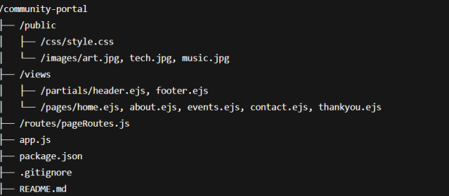
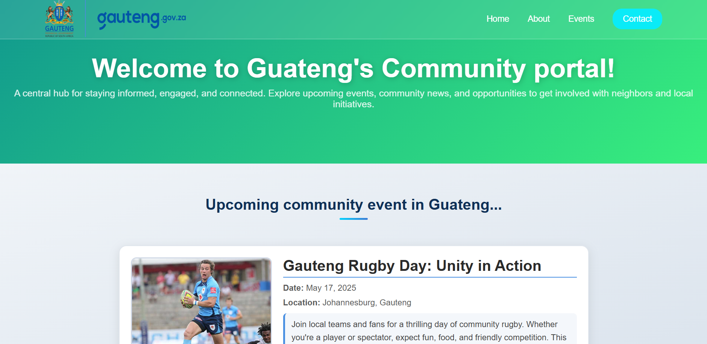
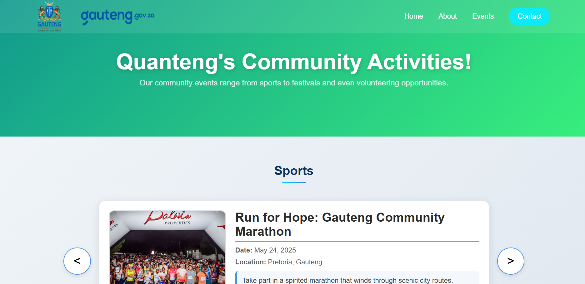
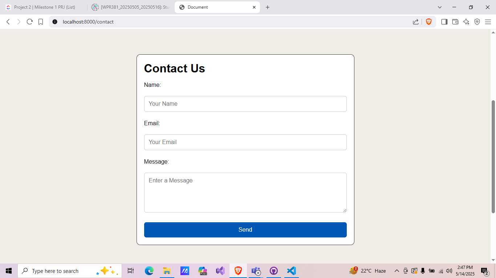
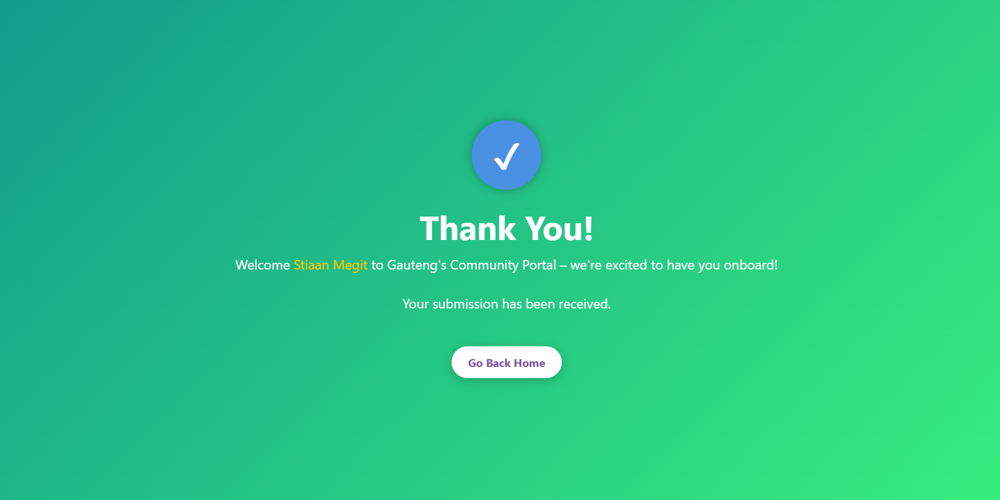
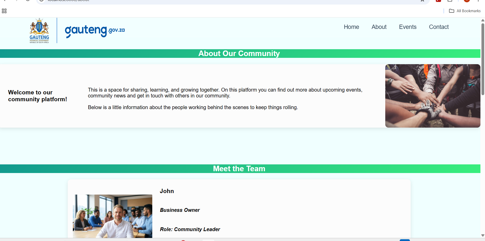

# Community Portal Project

## Project Title:

Gauteng Community Portal

## Overview:

This project was to create a community portal for the Gauteng-community. The portal has a home page showing the next upcoming event - when the day of the event passes, the next upcoming event is displayed. The about page provides information about the community and team behind the community portal. The events page shows all upcoming events, grouped together based on event type (eg. sports). The contact page allows a user to submit their contact details and the thank you page displays a personalised message after a user submits their details.

Starter boilerplate for a Node.js + Express + EJS website.

## Technologies Used

1. **Node.js(v18+)**: The Node js runtime environment was implemented to handle the server-side for this particular website.
2. **Express.js(v4+)**: Express is a lightweight web framework that was implemented in the pageroute.js and app.js files to handle the routing and server logic.
3. **EJS(v3+)**: We made use of this template engine to generate dynamic HTML elements such as the header and footer through partials and embedded Javascript. 4.**CSS**: Simple Cascade Style Sheets was implemented for the styling of the website 5.**Git and Github**: These version control systems were used for version control and fostered collaboration among the group. 6.**Nodemon**: A technology that is used for running the server live during development

## Team Members and Roles:

Stiaan Megit - 600819
Jeremy Kahora - 601206
Johanna Susanna Hoffmann - 601072

**Member no longer part of our group:**
Roebin Uys - 577626
(Roebin informed us that he was wrongly assigned to this module.)
Message from Roebin to our group on Monday, 12 May:
"GUYS there was an error on my schedule I am not supposed to have this subject I am actually a second year and I am not supposed to have this subject right now I am a second year and was wrongly scheduled ... i have sent an email about this to the dean - sorry for the inconvenience..."

1. **Roles:**
   **Team Lead:** Stiaan Megit
   **Back- and Front-end:** Everyone

**Documentation Manager:** Everyone responsible for a section:
**Team members and roles:** Susan Hoffmann
**Project Title and overview:** Susan Hoffmann
**Technology used:** Jeremy Kahora
**Setup Instructions:** Stiaan Megit

**Data manager:** Susan, Jeremy, Stiaan

2. **Application development - Responsibilities:**
   **Home, Events & Thank you pages:** Stiaan Megit
   **About:** Susan Hoffmann
   **Contact:** Jeremy Kahora

## Setup Instructions:

1. **Github repository:**

Our team lead (Stiaan Megit) created a repository called (community portal) on his github account. He made the rest of the team members collaborates to the repository giving them access to the ptoject.

2. **Boilerplate upload:**

We were given the following file structure for our project:

We added a JS folder to the public folder, then we committed this file structure to our github repository via VScode.

3. **Installing dependencies:**

In order to build a Node.js + Express.js Server-Side website we needed to locally install the following packages in the project folder to gain access to certain functionality:

- **Node.js(v18+)**
- **Express.js(v4+)**
- **Nodemon**
- **NPM**

4. **Running the development Server:**

We activated the development server using "npm run dev". This restarts the browser and updates the webpage when we changed the a backend javascript code.

## Screenshots:

1. Home page:
   

2. Event page:
   

3. Contact page:
   

4. Thankyou page:
   

5. About page:
   

## Reflection:

1. **Home page:** We could've added more content to the body of the home page besides the upcomming-event placeholder.

2. **Event page:** We could've added a better background to reduce its white color scheme and more information about its location. We could've also added a search bar were you could search for specific events. We could also add a calendar to make it easier for users to get a once-over view of all events per month.

3. **About page:** We could've made the team member cards a bit smaller, to display more information on a single view.
